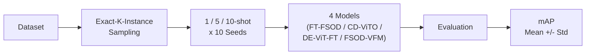

# Cross-Domain Few-Shot Object Detection Benchmark

*Reproducible evaluation across 3 datasets, 4 models, 3 shot settings, and 10 random seeds*

> 이 저장소는 FT-FSOD, CD-ViTO(CDFSOD-benchmark), FSOD-VFM 등 외부 연구 코드베이스를 clone해서
> 작업한 결과물이며, 여기에는 **제가 직접 작성한 코드만** 포함되어 있습니다. 각 모델의 원본
> 구현/저작권은 원저자에게 있습니다 (자세한 내용은 [Acknowledgements](#acknowledgements) 참고).

## Overview

- 서로 다른 3개 target domain(혈액 세포 현미경, X-ray 보안 검색, 열화상 드론 이미지)에서,
  4가지 Cross-Domain Few-Shot Object Detection(CD-FSOD) 방법을 **동일한 exact-K-instance
  프로토콜**로 비교했습니다.
- Few-shot split 생성/검증부터 모델별 학습·평가 파이프라인 연결, 반복 실험 자동화, 결과
  집계까지 전체 과정을 직접 수행했습니다.
- **3 datasets × 3 shots × 10 seeds × 4 models = 360 experiments**를 끝까지 실행했습니다.

## My Contribution

- **exact-K-instance few-shot split 생성**: TXL-PBC, HIT-UAV(seed 2~10)는 원본 train split으로부터
  직접 생성했고, SIXray-D는 기존에 검증된 split을 동일 기준으로 재검증·확장해 사용했습니다.
- **Dataset integrity validation**: 클래스별 annotation 개수, bbox 유효성, 1-shot ⊆ 5-shot ⊆
  10-shot 중첩 관계를 모든 seed·shot 조합에 대해 검증했습니다.
- **Train/val/test leakage 검증**: support set과 val/test 이미지 간 중복이 없는지 데이터셋별로
  확인했습니다.
- **3개 target dataset의 annotation/class mapping 정리**: 각 모델(Detectron2, MMDetection)이
  기대하는 category ID 체계에 맞춰 dataset registration 코드를 작성했습니다.
- **FT-FSOD, CD-ViTO, DE-ViT-FT, FSOD-VFM 실험 파이프라인 연결**: config 생성기와 dataset
  registration을 통해 4개의 서로 다른 코드베이스에 동일한 exact-K-instance 데이터를 연결했습니다.
- **1/5/10-shot × 10 seeds 반복 실험 자동화 + 재시작 가능한 experiment queue 구성**: 중단되어도
  완료된 job은 건너뛰고 이어서 실행되는 큐 스크립트를 작성했습니다.
- **모델별 config/evaluation script 정리 및 seed별 결과 집계(mean ± std)**를 수행했습니다.
- **실험 중 발견한 데이터/설정/evaluation 문제를 디버깅**했습니다 (상세: [Debugging &
  Lessons Learned](#debugging--lessons-learned)).

## Tech Stack

Python · PyTorch · Detectron2 · MMDetection · CUDA · Linux (bash 기반 실험 자동화)

## Experimental Overview

| 항목 | 값 |
|---|---|
| Datasets | TXL-PBC, SIXray-D, HIT-UAV |
| Shots | 1 / 5 / 10-shot |
| Seeds | 1–10 |
| Models | FT-FSOD, CD-ViTO, DE-ViT-FT, FSOD-VFM |
| Metric | mAP@[.50:.95], mean ± std (10 seeds) |



## Why Exact-K-Instance?

Few-shot object detection에서 "K-shot" support set을 이미지 K장으로 정의하면, 그 이미지에 있는
annotation을 전부 사용하게 되어 클래스별 실제 instance 수가 K와 다를 수 있습니다. 예를 들어
이미지 1장짜리 1-shot이 우연히 A 클래스 22개, B 클래스 1개를 포함할 수도 있습니다.

이 문제를 없애기 위해 공식 CD-FSOD 벤치마크는 K-shot을 **클래스당 정확히 K개의 annotation
instance**(각각 다른 이미지)로 정의합니다. 이 프로젝트는 이 정의를 세 데이터셋에 일관되게
적용해서, 4개 모델을 서로 다른 데이터 조건이 아니라 **동일한 support set 조건**에서 비교할 수
있게 만들었습니다.

또한 few-shot 성능은 어떤 K개의 샘플이 뽑혔는지에 따라 크게 달라질 수 있습니다. 이 랜덤성이
결과에 미치는 영향을 확인하기 위해 seed 1개가 아니라 **10개의 random seed**로 전체 실험을
반복했습니다.

<details>
<summary>구현 세부사항 (샘플링 알고리즘)</summary>

각 (데이터셋, seed) 조합마다 클래스를 고정된 순서로 처리합니다. 클래스별 후보 pool(해당
클래스 instance가 있는 모든 train 이미지)을 결정론적으로 정렬한 뒤 `random.Random(seed)`로
셔플하고, 앞에서부터 K장을 그 클래스의 pick으로 선택한 뒤 다음 클래스 처리 전에 후보 pool에서
제외합니다. 이 방식으로 이미지 1장에는 학습 annotation이 정확히 1개만 남고, 같은 seed 안에서
1-shot/5-shot/10-shot이 같은 셔플 순서의 prefix가 되어 1-shot ⊆ 5-shot ⊆ 10-shot이 자동으로
성립합니다. (SIXray-D는 기존에 확립되어 있던 seed 파일들이 클래스 간 이미지 공유를 허용하는
변형을 쓰고 있었고, 이 저장소는 그 데이터셋의 기존 방식을 그대로 따랐습니다 — 자세한 내용은
`data_generation/build_hituav_exact_kinstance_seed2to10.py` docstring 참고.)

</details>

## Results

**Key Findings**
- FT-FSOD가 3개 데이터셋 대부분의 설정에서 가장 높은 mAP를 보였습니다.
- Training-free 방식인 FSOD-VFM은 특히 1-shot처럼 support 데이터가 극히 적은 환경에서
  상대적으로 안정적인 결과를 보이는 경향이 있었습니다.
- Seed에 따라 성능 표준편차가 관찰되어, support set 구성이 결과에 영향을 줄 수 있음을
  확인했습니다.
- CD-ViTO는 추가 모듈을 제거한 버전인 DE-ViT-FT보다 대체로 높은 성능을 보였습니다.

(위 항목들은 관찰된 경향이며, 성능 차이의 구체적인 원인을 별도로 통제 실험한 것은 아닙니다.)

mAP@[.50:.95], mean ± std over 10 seeds, 0–100 스케일:

| 모델 | TXL-PBC (1/5/10-shot) | SIXray-D (1/5/10-shot) | HIT-UAV (1/5/10-shot) |
|---|---|---|---|
| **FT-FSOD** | 50.1±5.6 / 65.2±3.5 / 70.2±1.8 | 29.0±2.9 / 37.9±2.6 / 42.7±1.3 | 12.0±2.1 / 17.8±2.8 / 20.1±3.0 |
| **CD-ViTO** | 23.9±8.6 / 45.6±4.4 / 49.6±4.0 | 2.9±1.9 / 7.5±1.9 / 11.6±1.4 | 3.1±1.4 / 7.3±1.5 / 8.7±1.3 |
| **DE-ViT-FT** | 15.5±8.0 / 40.9±4.5 / 47.5±2.9 | 0.8±0.6 / 3.9±1.6 / 7.6±1.4 | 1.8±1.0 / 6.6±1.0 / 7.3±1.2 |
| **FSOD-VFM** | 40.7±1.1 / 42.7±1.0 / 43.3±0.5 | 9.8±5.1 / 13.5±1.4 / 13.8±1.3 | 8.9±2.6 / 13.2±1.5 / 14.4±1.5 |

전체 seed별 수치: [`results/summary_4models_10seeds_final.csv`](results/summary_4models_10seeds_final.csv)
FSOD-VFM 자체의 seed1 심층 분석(class-wise AP, VRAM, smoke test 산출물)은
[`results/README_RESULTS_SEED1.md`](results/README_RESULTS_SEED1.md)에 있습니다.

## Debugging & Lessons Learned

**1. K-image vs K-instance mismatch**
- Problem: 기존 TXL-PBC few-shot 파일의 "1-shot"이 실제로는 클래스당 K개가 아니었음
- Cause: 이미지 K장을 뽑고 그 안의 annotation을 전부 사용하는 방식으로 생성되어 있었음
  (예: 1-shot이 WBC 1개 + RBC 22개 + Platelets 2개)
- Fix: 원본 split으로부터 클래스당 정확히 K개 instance가 되도록 재생성
- Learned: "K-shot"이라는 이름만으로는 실제 정의를 알 수 없고, 클래스별 개수를 직접 세어
  검증해야 함

**2. Dataset path/config mismatch**
- Problem: 기존 SIXray-D 실험 결과 하나가 실제로는 잘못된 데이터로 학습됨
- Cause: 벤치마크 저장소에 번들로 들어있던, seed가 지정되지 않은 별도의 비-canonical 데이터
  사본을 참조하고 있었음
- Fix: 검증된 canonical 데이터 경로를 참조하도록 config를 다시 작성하고 재실행
- Learned: config의 데이터 경로가 "그럴듯해 보인다"는 것과 "검증된 파일을 가리킨다"는 것은
  다르며, 두 사본을 직접 diff로 대조해야 발견 가능했음

**3. Val/test leakage in checkpoint selection**
- Problem: best checkpoint 선정이 사실상 test set을 기준으로 이루어지고 있었음
- Cause: 학습 config의 `val_dataloader`가 실수로 `val.json`이 아닌 `test.json`을 참조
- Fix: validation을 실제 held-out val set으로 분리하고, test는 최종 checkpoint로 한 번만 평가
- Learned: train/val/test 분리가 파일명만으로는 보장되지 않으며, 실제 로드되는 경로를
  코드 레벨에서 재확인해야 함

**4. Small bounding box vanishing during prototype extraction**
- Problem: 특정 1-shot 조합에서 prototype 학습이 크래시함
- Cause: 서드파티 feature 추출 코드가 instance mask를 저해상도 patch grid로 리사이즈하는
  과정에서, 작고 위치가 애매한 bbox의 마스크가 완전히 사라짐 (K=1일 때 해당 클래스 자체가 소실)
- Fix: 이 리사이즈 연산을 동일하게 재현해 실패 조건을 미리 예측하는 필터를 support set
  생성 단계에 추가 (서드파티 코드는 수정하지 않음)
- Learned: 경계 조건은 로그의 에러 메시지만으로는 원인이 안 보일 수 있고, 실패를 재현하는
  최소 코드를 직접 작성해야 근본 원인을 알 수 있음

**5. Result aggregation loop bug**
- Problem: 일부 seed의 결과 값이 다른 seed 값으로 덮어써져 있었음
- Cause: 집계 스크립트에서 seed 반복문이 shot 반복문 바깥에 있어 변수가 재사용됨
- Fix: 반복문 중첩 구조를 수정하고, 모든 (model, dataset, shot) 조합의 완료 seed 수(n)가
  10인지 확인하는 완결성 체크를 추가
- Learned: 실험 자체가 맞아도 집계 코드의 사소한 버그가 최종 결과를 조용히 왜곡할 수 있어,
  결과를 보고하기 전 개수 기반 sanity check이 필요함

## Repository Structure

```
data/              exact-K-instance annotation JSON (TXL-PBC, HIT-UAV만 - 1/5/10-shot x seed1-10)
datasets/sixray_d/ SIXray-D 전용: 등록 코드 + split 재현 스크립트 + 집계 통계 (실제 데이터 미포함)
data_generation/   exact-K-instance 샘플링 + 검증 스크립트 (3개 데이터셋, 프레임워크 독립적)
ft_fsod/           MMDetection config 생성기 + 재시작 가능한 train/test 큐
cd_vito/           Detectron2 dataset registration, prototype 빌더, CD-ViTO/DE-ViT-FT 큐
fsod_vfm/          FSOD-VFM support 포맷 변환, smoke test, 가중치 로딩 검증, 실행 스크립트
patches/           CDFSOD-benchmark 원본 저장소에 적용한 작고 additive한 diff
results/           최종 집계 CSV 및 FSOD-VFM seed1 심층 분석 보고서
run_all_exact_multiseed_4models.sh   4개 모델 전체를 순서대로 실행하는 최상위 오케스트레이터
```

> `data/`에는 이미지 파일은 포함되어 있지 않고, TXL-PBC/HIT-UAV의 few-shot annotation(COCO 포맷
> JSON: file_name, bbox, category 등 메타데이터)만 들어 있습니다. **SIXray-D는 라이선스가 원본은
> 물론 파생 annotation의 재배포도 금지하고 있어 데이터를 올리지 않았고**, 대신
> [`datasets/sixray_d/`](datasets/sixray_d/)에 등록 코드와 split 재현 스크립트만 남겨 두었습니다.
> 원본 이미지는 세 데이터셋 모두 각 원저자로부터 별도로 받아야 합니다.

## Reproducibility

각 모델 폴더의 스크립트는 아래 항목이 준비되어 있으면 그대로 실행할 수 있습니다.

- 해당 모델의 **원본 저장소**를 clone (이 저장소는 코드만 포함하며 각 프레임워크 자체는
  포함하지 않음): [FT-FSOD](https://github.com/Intellindust-AI-Lab/FT-FSOD),
  [CDFSOD-benchmark](https://github.com/lovelyqian/CDFSOD-benchmark),
  [FSOD-VFM](https://github.com/Intellindust-AI-Lab/FSOD-VFM)
- 각 저장소가 안내하는 **공식 사전학습 checkpoint**
- **원본 데이터셋 이미지** (TXL-PBC, SIXray-D, HIT-UAV) — TXL-PBC/HIT-UAV는 annotation이
  [`data/`](data/)에 이미 포함되어 있어 이미지만 채우면 되지만, **SIXray-D는 annotation도 직접
  준비해야 합니다** (원본 확보 후 [`datasets/sixray_d/generate_fewshot_splits.py`](datasets/sixray_d/)로
  재생성, 자세한 내용은 해당 폴더의 README 참고).

예시 — FT-FSOD, TXL-PBC, 5-shot, seed 3:

```bash
cd FT-FSOD/                                    # Intellindust-AI-Lab/FT-FSOD의 clone
python generate_exactinstance_ftfsod_configs.py --seeds 3 --shots 5
./tools/dist_train.sh configs_cdfsod/final_configs_exact_instance/grounding_dino_swin-b_finetune_TXL-PBC_5shot_seed3.py 1 9995 0 --work-dir out/
```

전체 360개 실험은 `run_all_exact_multiseed_4models.sh`가 4개 모델을 비용이 낮은 순서대로
체이닝해서 실행하며, `.job_done` / `status.json` 마커를 기준으로 중단된 지점부터 재개됩니다.
단일 GPU(RTX 4070 Ti, 12GB) 기준 전체 실행에는 약 2주가 소요되었고, FSOD-VFM의 하이퍼파라미터는
공식 값 그대로 사용해 데이터셋별로 튜닝하지 않았습니다.

## Acknowledgements

이 프로젝트는 아래 공식 저장소/코드베이스를 clone하여 실험 대상으로 삼았으며, 각 모델의
구현과 학습된 가중치는 원저자에게 저작권이 있습니다.

- [FT-FSOD](https://github.com/Intellindust-AI-Lab/FT-FSOD) (Intellindust AI Lab)
- [CDFSOD-benchmark / CD-ViTO](https://github.com/lovelyqian/CDFSOD-benchmark) 및 그 안에
  포함된 [DE-ViT](https://github.com/mlzxy/devit) 아키텍처
- [FSOD-VFM](https://github.com/Intellindust-AI-Lab/FSOD-VFM) (ICLR 2026) — 이 모델이 기반한
  [No-Time-To-Train](https://github.com/miquel-espinosa/no-time-to-train),
  [SAM2](https://github.com/facebookresearch/sam2),
  [ChatRex](https://github.com/IDEA-Research/ChatRex) (UPN),
  [DINOv2](https://github.com/facebookresearch/dinov2)
- 데이터셋 원저자: [TXL-PBC](https://github.com/lugan113/TXL-PBC_Dataset),
  [HIT-UAV](https://github.com/suojiashun/HIT-UAV-Infrared-Thermal-Dataset), SIXray-D
